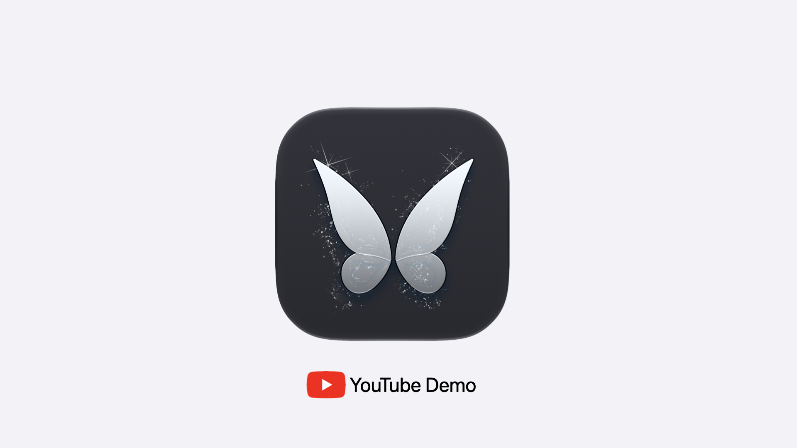

[](https://youtu.be/QhzZxTYLpzw)

# Tinkerble
Tinkerble is debug companion system for SwiftUI apps on Apple platforms. It lets an app register tweakable values and actions, send logs to a macOS companion app, receive live value edits back from the Mac, and trigger app-side commands during development.
The package is intentionally small and modular:
- `Tinkerble`: app-facing library with `@TinkerbleState`, `.tinkerbleAction`, `@TinkerbleObservableState`, `@TinkerbleAction`, `TinkerLog`, core tweak models, and the socket client transport.
- `TinkerbleCompanionCore`: macOS companion store and socket server.
- `TinkerbleCompanion`: SwiftUI macOS companion executable with a log console and tweak inspector.
- `Tinkerble Demo`: local iOS demo project that imports the package.

## Implementation Loop
1. The macOS companion advertises `_tinkerble._tcp` with Bonjour.
2. The app discovers the companion and connects over a length-prefixed JSON socket.
3. `@TinkerbleState`, `.tinkerbleAction`, `@TinkerbleObservableState`, and `@TinkerbleAction` register tweakable values and actions.
4. The companion displays tweaks by screen, with uncategorized values first, then grouped categories.
5. Editing a companion control sends an update back to the app.
6. Tapping an action button sends a trigger back to the app.
7. The app applies value updates or runs the registered action closure.
8. `TinkerLog.print` and `TinkerLog.log` send strings to the companion console.

## Platform Support
Tinkerble's client library is designed to be platform-agnostic across Apple SwiftUI apps. The same `Tinkerble` product should work from iOS, macOS, tvOS, watchOS, and visionOS apps as long as the app can import SwiftUI and Observation and open a TCP connection to the Mac running the companion.
The current repository has first-class demo coverage for iOS Simulator and a macOS companion app, and the package currently declares iOS and macOS minimums.
There are not yet tvOS, watchOS, or visionOS demo projects in this repo, so those platforms should be treated as expected-compatible rather than separately demo-verified.

## Debug And Release Builds
Tinkerble's app-facing behavior is compiled for `DEBUG` builds only. In Release builds, the public API stays available so app source code does not need conditional imports or wrappers, but runtime behavior is intentionally inert: `Tinkerble.shared` does not connect, register, send updates, or forward logs; `@TinkerbleState` falls back to ordinary SwiftUI `@State`; `.tinkerbleAction` passes the view through; and observable/action macro registration helpers do not activate.

The Release implementation is also shaped to minimize what reaches the app binary. The socket transport compiles as a no-op stub without the `Network` framework path, and the debug-only registry, remote update handlers, action boxes, and observable tracking machinery are kept behind `#if DEBUG`. Some public value types and signatures remain because consumer code references them, but the development transport and companion registration behavior should not be reachable from a Release app build.

## Install Tinkerble In Your App
Install the `tinkerble` command:
```sh
curl -fsSL https://raw.githubusercontent.com/edwardsanchez/Tinkerble/main/install.sh | sh
```

Then run it from your app repository:
```sh
cd /path/to/MyApp
tinkerble install
```

The installer adds the Tinkerble Swift package, links the `Tinkerble` product to your selected app target, adds the local-network plist setup, and adds a Debug-only build phase that launches the macOS companion from the resolved package checkout.
Xcode still owns normal package updates after installation: update Tinkerble through Xcode's package UI and the build phase will continue to use the scripts from the resolved package version.
Use explicit flags when scripting the install or working in a repo with multiple projects or app targets:
```sh
tinkerble install --project MyApp.xcodeproj --target MyApp
tinkerble install --project MyApp.xcodeproj --target MyApp --target DemoApp
tinkerble install --project MyApp.xcodeproj --target MyApp --dry-run
```

## Quick Start For This Package

From the package root:
```sh
swift test
```

Then build and run `Tinkerble Demo` in Xcode. The shared demo scheme builds the macOS companion and restarts it automatically for Debug builds before the app target builds. You can opt out for a build with:
```sh
TINKERBLE_COMPANION_AUTOLAUNCH=0 xcodebuild ...
```

You can also run both apps from the command line:
```sh
./Scripts/run-tinkerble-demo.sh
```

The demo app discovers the companion with Bonjour, so the same code path works on Simulator and on physical devices that are on the same local network as the Mac. iOS will show the Local Network permission prompt the first time a device build searches for the companion.

`Scripts/package-macos-companion.sh` builds `build/Tinkerble.app`, compiles `Tinkerble.icon` into `Contents/Resources/Assets.car` with Xcode 26 `actool`, writes the user-visible app name as `Tinkerble`, removes legacy `.icns` sidecars, and ad-hoc signs the app for local development. `Scripts/ensure-macos-companion-running.sh` packages that app, opens it as a normal macOS app when needed, restarts it when passed `--restart`, and verifies that `TinkerbleCompanion` is listening for socket connections. `Scripts/launch-macos-companion.sh` uses the same path with `--restart` for manual relaunches.

## Command-Line Demo Build
When building the demo project from the command line, pass the package checkout directory:

```sh
xcodebuild \
  -project "Tinkerble Demo/Tinkerble Demo.xcodeproj" \
  -scheme "Tinkerble Demo" \
  -destination "generic/platform=iOS Simulator" \
  -clonedSourcePackagesDirPath .build-demo-validation \
  build
```

## Manual Package Setup
In Xcode:
1. Add the local package at the repository root, or add the remote repository URL.
2. Link the `Tinkerble` product to the app target.
3. Add a Debug-only build script that calls `Scripts/ensure-macos-companion-running.sh` from the package checkout. That hook packages and launches the macOS companion automatically when your app target builds.

In `Package.swift`:
```swift
.package(url: "https://github.com/edwardsanchez/Tinkerble.git", branch: "main")
```

Then add:
```swift
.product(name: "Tinkerble", package: "Tinkerble")
```

## Plist Setup
App plist:
```xml
<key>NSLocalNetworkUsageDescription</key>
<string>Tinkerble connects to the macOS companion app on your local development network.</string>
<key>NSBonjourServices</key>
<array>
    <string>_tinkerble._tcp</string>
</array>
```

An app needs local network permission when discovering or connecting to a Mac on the LAN. `Tinkerble.shared.connect()` uses Bonjour discovery by default. Use `Tinkerble.shared.connect(host: "192.168.1.10", port: 7777)` only when you intentionally want a manual host override.
macOS companion plist, if packaged as a normal app bundle:

```xml
<key>NSLocalNetworkUsageDescription</key>
<string>Tinkerble listens for debug connections from local iOS development builds.</string>
<key>NSBonjourServices</key>
<array>
    <string>_tinkerble._tcp</string>
</array>
```

The SwiftPM companion executable is not sandboxed by default. If you package and sandbox the companion later, add the appropriate incoming network entitlement too.

## Usage
Start the client in the app:
```swift
import Tinkerble

@main
struct DemoApp: App {
    init() {
        Tinkerble.shared.connect()
    }

    var body: some Scene {
        WindowGroup { ContentView() }
    }
}
```

Use `@TinkerbleState` for SwiftUI view-local tweakable state:
```swift
@TinkerbleState(name: "Title")
private var title = "Demo"

@TinkerbleState(category: "Layout", name: "Width", control: .slider(5...400))
private var width = 120

@TinkerbleState(category: "Layout", name: "Opacity", control: .slider(0.0...1.0))
private var opacity = 0.5

@TinkerbleState(category: "Flags", name: "Enabled")
private var isEnabled = true

@TinkerbleState(category: "Palette", name: "Accent Color")
private var accent = Color.blue
```

Swift does not reliably expose the wrapped variable name to the property wrapper, so `name` is required. `screen` and `category` are optional. Omit `screen` for the default screen, and use it when one app view registers a distinct group of controls. Values without a category appear above categorized groups.

Use `@TinkerbleObservableState` for normal stored properties inside `@Observable` classes. Add `@TinkerbleObservable` to the class and keep using normal Observation and `@Bindable` bindings from SwiftUI:

```swift
@TinkerbleObservable
@Observable
@MainActor
final class Model {
    @TinkerbleObservableState(category: "Observable", name: "Badge Text", screen: "Basic")
    var badgeText = "Observable Model"

    @TinkerbleObservableState(category: "Observable", name: "Badge Count", screen: "Basic", control: TinkerbleControl<Int>.plain)
    var badgeCount = 2
}

struct EditorView: View {
    @Bindable var model: Model

    var body: some View {
        TextField("Badge Text", text: $model.badgeText)
    }
}
```

`@TinkerbleObservableState` supports the same `name`, `category`, `screen`, and `control` arguments as `@TinkerbleState`, but it does not create projected SwiftUI bindings. The property remains a normal Observation-tracked property, so SwiftUI bindings come from `@Bindable`.

Use `.tinkerbleAction` to expose a companion button from a SwiftUI view:
```swift
struct FanDeckView: View {
    @State private var isExpanded = false

    var body: some View {
        DeckView(isExpanded: isExpanded)
            .tinkerbleAction("Fan Out / Collapse", screen: "Fan Deck", category: "Animation") {
                isExpanded.toggle()
            }
    }
}
```

Use `@TinkerbleAction` and `@TinkerbleActions` for zero-parameter methods on `@Observable` classes. Call the generated `activateTinkerbleActions()` once from `init`:
```swift
@TinkerbleActions
@Observable
@MainActor
final class Model {
    var actionCount = 0

    init() {
        activateTinkerbleActions()
    }

    @TinkerbleAction(name: "Increment Action Count", screen: "Basic", category: "Observable")
    func incrementActionCount() {
        actionCount += 1
    }
}
```

`@TinkerbleAction` methods must not take parameters. They support optional `name`, `screen`, and `category` arguments. If `name` is omitted, Tinkerble uses the method name.

Basic enums use `TinkerbleEnum`:
```swift
enum DemoMode: String, CaseIterable, TinkerbleEnum {
    case compact
    case expanded
}

@TinkerbleState(category: "Modes", name: "Mode")
private var mode = DemoMode.compact
```

Send logs:
```swift
TinkerLog.print("User tapped Save")
TinkerLog.log("Current opacity: \(opacity)")
```

## Text Controls
Strings use a regular input field by default:
```swift
@TinkerbleState(name: "Title")
private var title = "Demo"
```

You can opt into a text area, or ask Tinkerble to pick one when the registered text is longer than 25 characters:
```swift
@TinkerbleState(name: "Notes", control: .area)
private var notes = "Longer copy"

@TinkerbleState(name: "Subtitle", control: .text(.automatic))
private var subtitle = "Short copy"
```

## Numeric Controls
Integer controls expose integer-only APIs:
```swift
@TinkerbleState(name: "Count", control: TinkerbleControl<Int>.plain)
private var count = 3

@TinkerbleState(name: "Columns", control: .slider(1...6))
private var columns = 3
```

Decimal controls expose decimal configuration:

```swift
@TinkerbleState(name: "Opacity", control: .slider(0.0...1.0, decimalPlaces: 2))
private var opacity = 0.5
```

Defaults:
- `0.0...1.0` defaults to 2 decimal places.
- Larger integer-like decimal ranges such as `0.0...100.0` default to 0 decimal places.
- `Int` controls do not accept `decimalPlaces`.
- Numeric controls are only available for numeric value types.

## Running Both Apps
Automatic mode:
- Build `Tinkerble Demo` in Xcode with the shared scheme.
- The Debug build phase builds and restarts the macOS companion.
- The app discovers the companion with Bonjour, then connects to the advertised socket.

Fixed target mode:
```sh
TINKERBLE_SIMULATOR_UDID=<simulator-udid> TINKERBLE_INTERACTIVE=0 ./Scripts/run-tinkerble-demo.sh
```

Interactive target mode:
```sh
./Scripts/run-tinkerble-demo.sh
```

The script lists available iPhone simulators, starts the macOS companion, builds the iOS demo with the local package, installs it, and launches it.
Fixed mode is better for CI and repeatable local workflows. Interactive mode is better when switching devices frequently.

## Manual Validation Checklist
- Run `swift test`.
- Run `./Scripts/verify-macos-companion-package.sh`.
- Run `./Scripts/launch-macos-companion.sh`.
- Run the iOS demo on Simulator or a physical device on the same local network.
- Confirm the companion shows:
  - `Title` above categories.
  - `Enabled` under `Flags`.
  - `Accent Color` under `Palette`.
  - `Card Count` and `Opacity` under `Layout`.
  - `Mood` under `Modes`.
  - `Fan Out / Collapse` button under `Animation` on the `Fan Deck` screen.
  - `Increment Action Count` under `Observable` on the `Basic` screen.
- Edit each companion control and confirm the app UI updates.
- Tap each companion action button and confirm the app UI updates.

## Current Limitations
- Arrays, dictionaries, arbitrary structs, nested models, `ObservableObject`, and `@Published` are intentionally unsupported.
- `@TinkerbleState` is main-actor SwiftUI view state.
- `@TinkerbleObservableState` is for default-initialized `@Observable` classes marked with `@TinkerbleObservable`. Classes with explicit custom initializers are not supported yet.
- The app-facing package intentionally has a compile-time SwiftSyntax macro dependency for `@TinkerbleObservable` and `@TinkerbleActions`.
- Only one active companion session is tracked.
- The companion UI is intentionally basic.

## License
Tinkerble is available under the Apache License 2.0. See `LICENSE` for details.

## Future Work
- Remembered manual device selection for networks where Bonjour is unavailable.
- Reconnect and connection health details.
- Multiple client sessions.
- Log categories, levels, grouping, typed values, colors, filtering, search, timestamps, and export.
- Better enum display customization.
- Packaged macOS app bundle with entitlements and plist.
